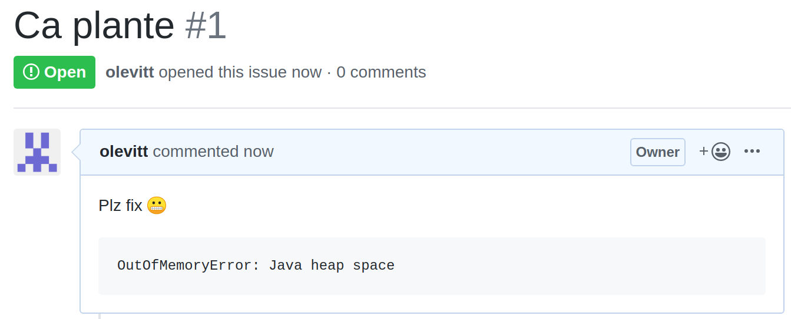
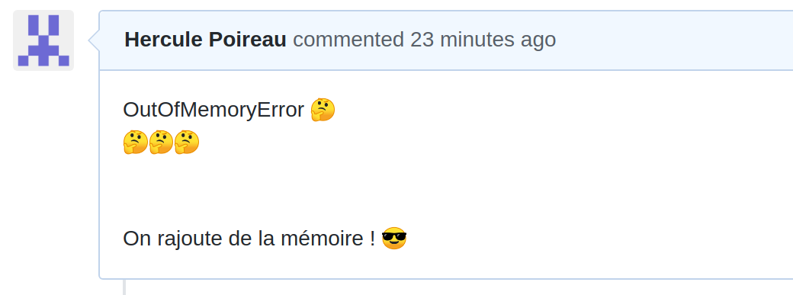
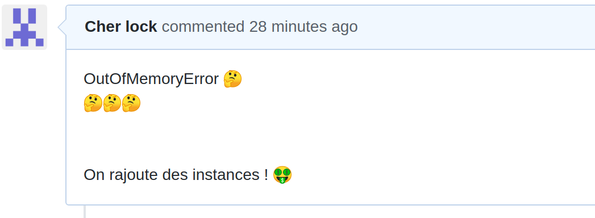

<!-- .slide: class="slide" -->

# Le crime

<!-- .element: class="fragment" -->

--

--

--

## Retour aux sources

---

# On commence par quoi ?

## Aller sur la scène de crime

ou

## Interroger les suspects

---

# L'enquête continue !

https://github.com/olevitt/profiling
