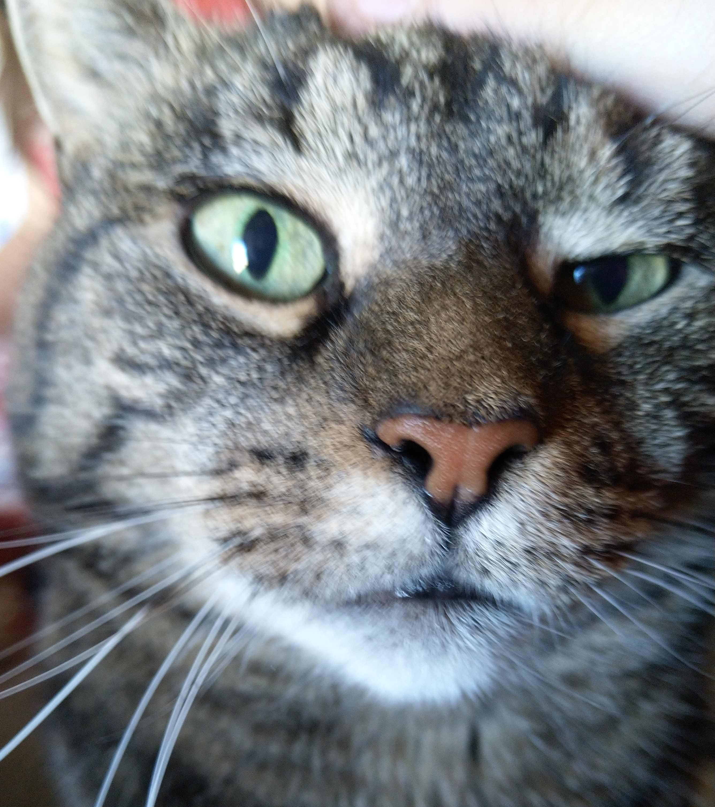

<!-- .slide: class="slide" -->

# Le crime

<!-- .element: class="fragment" -->

--

--

--

## Retour aux sources

---

# On commence par quoi ?

## Aller sur la scène de crime

ou

## Interroger les suspects

--

# Le matériel

--

# VisualVM

https://visualvm.github.io/

- Profiler
- CPU, mémoire, SQL

=> Local, dev (JMX)

--

# Glowroot

https://glowroot.org/

- APM (Application performance management)
- Very (very) low overhead
- "Java-aware"

=> Local, dev, prod

--

# Arthas

https://github.com/alibaba/arthas

- "Diagnostic tool"
- Boite à outils magique
- Monitoring
- Décompilation / recompilation

=> Local, dev, (prod)

---

# L'enquête continue !

https://github.com/olevitt/profiling

<!-- .element height="30%" width="30%" -->
